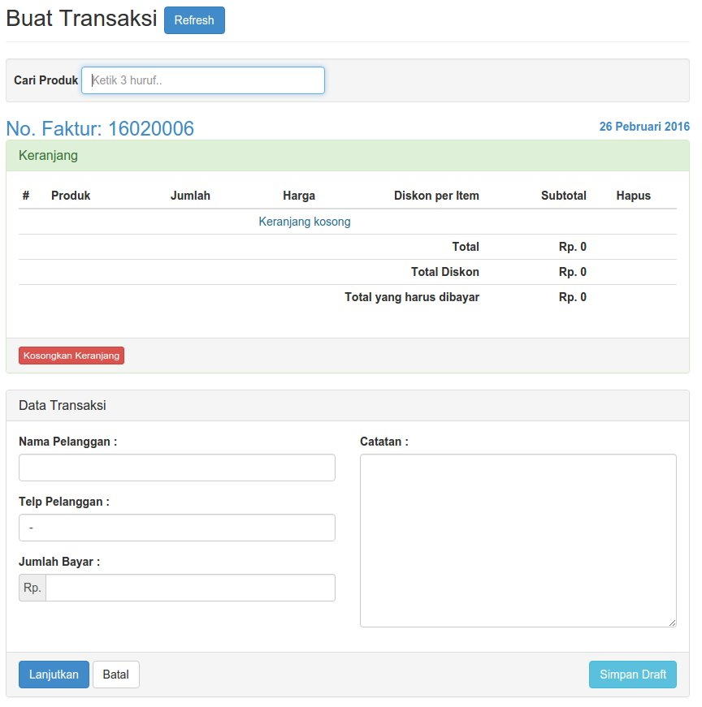
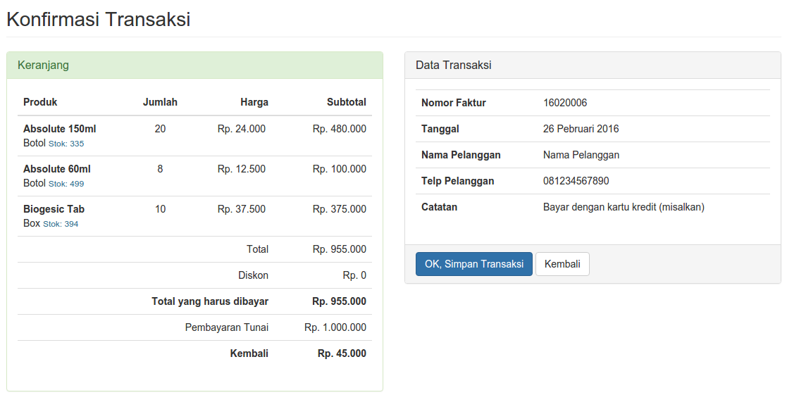
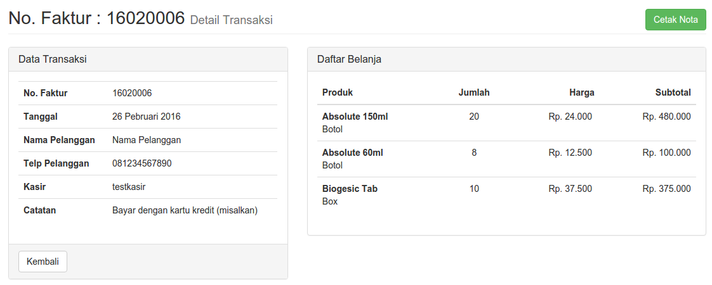
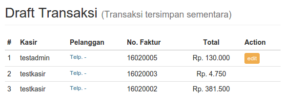
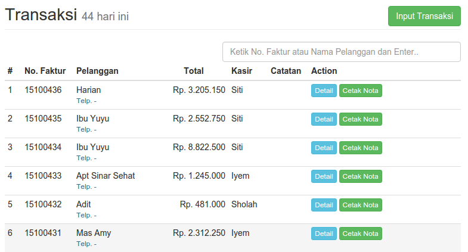
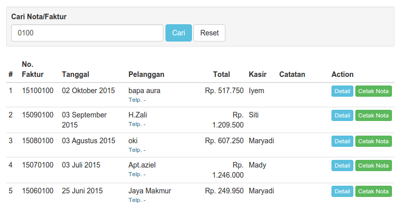
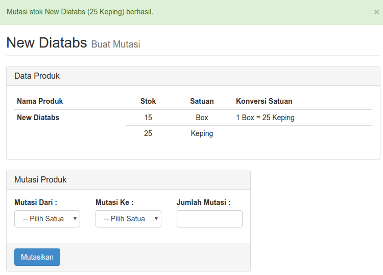

# Panduan Kasir
**Kasir** adalah tipe pengguna/user yang dapat melakukan aktifitas berikut:

1. [Membuat/Input Transaksi](#membuat-input-transaksi)
* [Keranjang](#keranjang)
* [Melihat Detail Transaksi](#detail-transaksi)
* [Mencetak Nota/Faktur](#detail-transaksi)
* [Melihat Daftar Transaksi Hari ini](#daftar-transaksi-hari-ini)
* [Mencari Nota/Faktur](#mencari-notafaktur)
* [Mutasi Stok](#mutasi-stok)

## Membuat/Input Transaksi
Yaitu melakukan input transaksi penjualan produk kepada customer dan menyimpan transaksi sebagai draft (simpan sementara).

### Mencari dan Input Produk ke Keranjang

1. Klik pada menu **Input Transaksi**
* Pada Kolom **Cari Produk**, Ketik nama Produk minimal 3 huruf, muncul daftar produk
* Pilih produk sesuai satuannya, isikan **Jumlah** yang akan dimasukkan ke **Keranjang** (Catatan: Perhatikan Stok Produk yang bersangkutan)
* Klik tombol **Tambah**
* Produk tersebut akan masuk ke **Keranjang**
* Ulangi langkah ke 2 s/d ke 4 untuk menambahkan produk lainnya
* Klik tombol **Refresh** untuk menghilangkan hasil pencarian

## Keranjang
**Keranjang** adalah daftar produk yang akan dibeli oleh pelanggan. Pada keranjang, kasir dapat menambahkan item (produk), menghapus produk, menambahkan/mengurangi jumlah, dan memberikan diskon per item.

### Menggunakan keranjang

1. **No. Faktur** adalah Nomor Transaksi yang akan dibuat, dengan format tahun-bulan-no.urut (yymmxxxx)
* **Tanggal** adalah tanggal hari ini yang merupakan tanggal transaksi diinput
* Ubah kolom **Jumlah** pada kolom yang diinginkan, lalu tekan **Enter**, **Subtotal** item otomatis akan berubah (Harga Satuan x Jumlah)
* Isikan **Diskon per Item** (jika ada), lalu tekan **Enter**, diskon akan terakumulasi secara otomatis pada kolom **Total Diskon** (diskon per item x jumlah)
* Kolom **Hapus** untuk menghapus item yang batal/tidak jadi. Klik tanda silang **(x)** pada kolom Hapus -> **OK**, maka item akan terhapus dari keranjang.
* Tombol **Update Harga** digunakan untuk mengupdate harga yang ada pada keranjang (jika admin telah mengubah harga produk tersebut)
* **Total** ada adalah jumlah total belanja pelanggan sebelum dipotong Diskon
* **Total yang harus dibayar** adalah jumlah total belanja pelanggan setelah dipotong diskon

!!! warning "Catatan"
    * Baris item pada keranjang akan **berwarna merah** jika ada masalah **Stok** produk
    * Jika masih ada baris item yang berwarna merah, transaksi tidak dapat dilanjutkan/disimpan

### Melanjutkan Proses Transaksi
Jika sudah selesai mengisi keranjang sesuai pesanan Pelanggan

1. Isikan **Nama Pelanggan**, **No. Telp**, dan **Jumlah Bayar**
* **Jumlah Bayar** diisi :
    * Minimal sejumlah **Total yang harus dibayar**
    * Maksimal sejumlah **Total yang harus dibayar + 100.000**
* Isikan **Catatan** transaksi jika diperlukan
* Klik **Lanjutkan**
* Pada halaman **Konfirmasi Transaksi**, periksa kembali daftar produk, satuan, harga, jumlah item, nama/telp Pelanggan
* Klik tombol **Kembali** jika ingin ada perbaikan pada Keranjang atau Data Transaksi
* Klik tombol **OK, Simpan Transaksi** untuk menyimpan transaksi

## Detail Transaksi
Halaman informasi detail sebuah transaksi pembelian Pelanggan

Keterangan Gambar:

1. Data Transaksi
* Daftar Belanja
* Tombol **Cetak Nota** untuk mencetak nota atau faktur belanja Pelanggan

## Draft Transaksi
Adalah transaksi yang disimpan untuk sementara

### Menyimpan Transaksi ke Dalam Draft
1. Input transaksi baru
* Isi keranjang
* Klik tombol **Simpan Draft**
* Transaksi akan masuk ke dalam daftar **Draft Transaksi**
    

### Edit Draft Transaksi
1. Diakses melalui **Transaksi** > **Draft Transaksi**
* Muncul daftar transaksi yang telah disimpan sebagai draft
* Klik tombol **Edit** untuk melanjutkan transaksi yang tersimpan
* Tombol **Edit** akan muncul sesuai dengan pemilik transaksi (User yang membuatnya)
* Lakukan pencarian Produk, pengisian Keranjang, Nama Pelanggan, Telp, dan Jumlah Bayar
* Tekan tombol **Update Draft** untuk menyimpan (masih sebagai draft)
* Tekan tombol **Lanjutkan** jika ingin melanjutkan dan menyelesaikan transaksi
* Tekan tombol **Hapus Draft** untuk membatalkan draft transaksi
    

## Daftar Transaksi Hari Ini
Adalah menu/halaman untuk melihat daftar transaksi/nota yang dibuat pada hari ini.

### Mencari Daftar Transaksi Hari Ini
1. Klik menu **Transaksi** > **Transaksi Hari Ini**
* Ketik bagian dari **Nomor Nota/Faktur** atau bagian dari **Nama Pelanggan**, tekan **Enter**
* Klik **Detail** pada transaksi yang diinginkan, maka akan terlihat detail/rincian transaksinya
* **Cetak Nota** apabila ingin mencetak nota

## Mencari Nota/Faktur
Mencari nota sesuai nomor faktur yang telah dibuat untuk melihat detail transaksi dan mencetak ulang nota.

1. Klik menu **Cari Nota**
* Isi nomor faktur atau nama pelanggan untuk mencari nota, klik **Cari**
* Klik **Detail** untuk melihat rincian/detail nota
* Klik **Cetak Nota** untuk mencetak nota

## Mutasi Stok
Yaitu untuk melakukan pemindahan stok dari satuan besar ke satuan kecil.
Misalnya:

* Produk memiliki satuan **Dus** dan **Botol**
* Satu Dus = 10 Botol
* Di dalam stok ada **7 Dus** dan **1 Botol**
* Kemudian 1 Dus akan dibuka menjadi 10 Botol
* Stok berubah menjadi: **6 Dus** dan **11 Botol**

### Cara Memutasi Stok

1. Buka Menu **Mutasi Stok**
* Ketik nama produk yang ingin dimutasi, klik **Cari**
* Pada kolom **Stok** akan terlihat jumlah Stok setiap Satuan
* Klik tombol **Buat Mutasi** pada produk yang akan dimutasikan
    
* Isi kolom **Mutasi Produk** beserta jumlah mutasinya
* Klik **Mutasikan** dan jumlah Stok Satuan akan berubah setelah dimutasi
    
